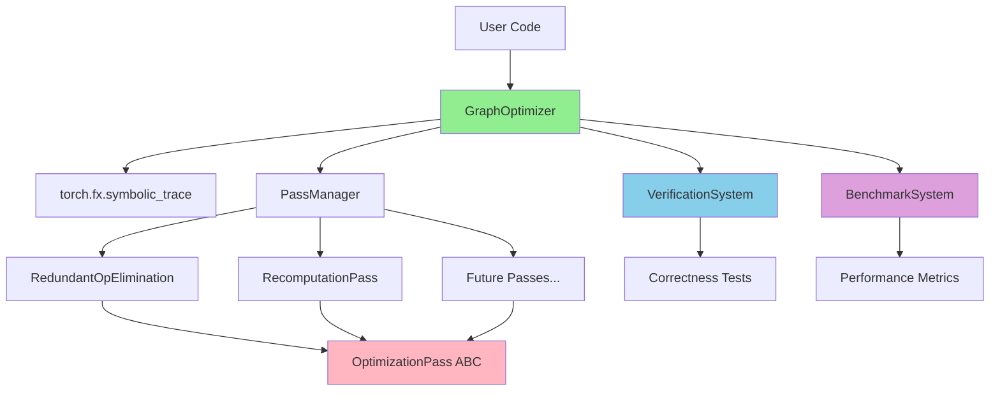
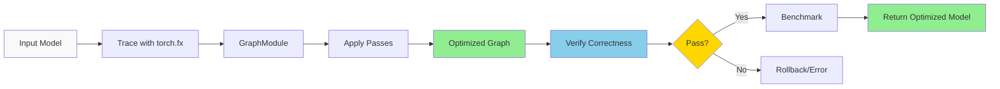

# PyTorch FX Graph Optimizer - Architecture

**Purpose**: Complete system design for a graph optimization framework
**Audience**: Developers with basic torch.fx knowledge
**Goal**: Teach concepts AND define implementable architecture

---

## 1. SYSTEM OVERVIEW

### High-Level Design



**Components:**
- **GraphOptimizer**: Main entry point, orchestrates everything
- **PassManager**: Applies optimization passes in order
- **OptimizationPass**: Abstract base for all passes
- **VerificationSystem**: Ensures correctness
- **BenchmarkSystem**: Measures improvements

### Data Flow



**Flow:**
1. **Trace**: Convert PyTorch model to graph representation
2. **Optimize**: Apply selected optimization passes sequentially
3. **Verify**: Check numerical correctness against original
4. **Benchmark**: Measure improvements
5. **Return**: Provide optimized model or error

### Core Principles

**1. Safety First**
- Always verify correctness before returning optimized model
- Fail loudly with clear error messages
- Never silently produce wrong results

**2. Composability**
- Each pass is independent and reusable
- Passes can be combined in any order
- Clean separation of concerns

**3. Measurability**
- Every optimization must prove its value
- Benchmark before/after for every change
- Track both improvements AND regressions

**4. Simplicity Over Perfection**
- Start with simple algorithms that work
- Document limitations honestly
- Leave room for future sophistication

---

## 2. CORE COMPONENTS

### GraphOptimizer Class

**Purpose**: Main entry point that orchestrates the optimization pipeline

**Responsibilities**:
- Trace PyTorch models using torch.fx
- Manage optimization pass execution
- Coordinate verification
- Provide clean, user-friendly API

**Key Methods**:

```python
class GraphOptimizer:
    def __init__(self, model: nn.Module, device: str = 'cpu'):
        """
        Initialize optimizer with a PyTorch model.

        Args:
            model: PyTorch nn.Module to optimize
            device: Device to run on ('cpu', 'mps', 'cuda')
        """

    def optimize(self, passes: List[str]) -> GraphModule:
        """
        Apply optimization passes to the model.

        Args:
            passes: List of pass names to apply (e.g., ['redundant_ops', 'recompute'])

        Returns:
            Optimized GraphModule

        Raises:
            VerificationError: If optimized model produces wrong results
        """

    def verify_correctness(self, test_inputs: Tensor, rtol: float = 1e-5) -> bool:
        """
        Verify optimized model matches original output.

        Args:
            test_inputs: Sample inputs for testing
            rtol: Relative tolerance for floating point comparison

        Returns:
            True if outputs match within tolerance
        """

    def benchmark(self, test_inputs: Tensor, num_runs: int = 100) -> Dict[str, float]:
        """
        Benchmark original vs optimized model.

        Returns:
            Dictionary with metrics: memory, time, graph_size
        """
```

**Design Decision**:

**Why this API?**
- **Explicit pass selection**: User controls which optimizations run (no magic)
- **Automatic verification**: Safety by default, can't skip correctness checks
- **Integrated benchmarking**: Makes it easy to measure improvements
- **Device-aware**: Handles MPS/CUDA/CPU transparently

**Trade-off**: More verbose than auto-optimization, but safer and more predictable.

---

### OptimizationPass (Abstract Base Class)

**Purpose**: Define the contract that all optimization passes must follow

**Required Methods**:

```python
from abc import ABC, abstractmethod

class OptimizationPass(ABC):
    """Base class for all optimization passes."""

    @abstractmethod
    def analyze(self, graph: fx.Graph) -> Dict[str, Any]:
        """
        Analyze graph to find optimization opportunities.

        Args:
            graph: torch.fx Graph to analyze

        Returns:
            Dictionary with analysis results:
            - 'opportunities': List of nodes/patterns to optimize
            - 'stats': Statistics about potential savings
            - 'safe': Whether optimization is safe to apply
        """
        pass

    @abstractmethod
    def transform(self, graph: fx.Graph) -> fx.Graph:
        """
        Apply optimization transformation to the graph.

        Args:
            graph: torch.fx Graph to transform (modified in-place)

        Returns:
            The modified graph (same object, returned for chaining)

        Side effects:
            Modifies graph in-place
        """
        pass

    @abstractmethod
    def verify(self, graph: fx.Graph) -> bool:
        """
        Verify the transformation is valid.

        Args:
            graph: Transformed graph to verify

        Returns:
            True if graph is valid after transformation

        Checks:
            - No dangling references
            - Graph is well-formed (lint passes)
            - Optimization invariants maintained
        """
        pass

    @property
    @abstractmethod
    def name(self) -> str:
        """Unique name for this pass (e.g., 'redundant_ops')."""
        pass
```

**Design Decision**:

**Why this three-step pattern?**

1. **Analyze**: Separate analysis from transformation
   - Can report what would happen without doing it
   - Useful for debugging and logging
   - Allows cost estimation before committing

2. **Transform**: Do the actual work
   - Clear separation of concerns
   - Easy to test independently
   - Can be disabled while keeping analysis

3. **Verify**: Self-check the transformation
   - Catch bugs early
   - Each pass validates its own invariants
   - Defense in depth (beyond global verification)

**Alternative considered**: Single `run()` method that does everything.
**Rejected because**: Harder to debug, can't analyze without modifying, less composable.

---

## 3. OPTIMIZATION PASSES (Teaching Section)

### Pass 1: Redundant Operation Elimination

#### What is a redundant operation?

A **redundant operation** is when the same computation is performed multiple times with identical inputs, producing identical outputs. This wastes computation and memory.

**Key insight**: If `f(a, b) = f(a, b)` and `f` is pure (no side effects), we only need to compute it once.

#### Example: Redundant Computation

```python
# Before optimization:
def forward(self, x):
    # Both conv operations use SAME input and SAME weights
    a = F.conv2d(x, self.weight, bias=self.bias)
    b = F.conv2d(x, self.weight, bias=self.bias)  # REDUNDANT!
    return a + b

# After optimization:
def forward(self, x):
    a = F.conv2d(x, self.weight, bias=self.bias)
    b = a  # Reuse the result
    return a + b

# Saves: 1 convolution operation (expensive!)
```

#### Real-World Example: Accidental Redundancy

```python
class BuggyModel(nn.Module):
    def forward(self, x):
        # Programmer copy-pasted code and forgot to change variable
        feature1 = self.encoder(x)
        feature2 = self.encoder(x)  # Oops, should be different input!
        return feature1 + feature2

# Optimizer detects: encoder(x) called twice with same input
# Result: 2x speedup, 50% memory reduction
```

#### Algorithm Design

**Data Structure**: Hash map from `(operation, inputs)` to `existing_node`

```python
def eliminate_redundant_ops(graph: fx.Graph):
    seen_ops = {}  # (op_hash) -> node

    for node in graph.nodes:
        if node.op == 'call_function' or node.op == 'call_module':
            # Compute hash of (operation + inputs)
            op_hash = hash_operation(node)

            if op_hash in seen_ops and is_pure_operation(node):
                # REDUNDANT: replace with existing node
                existing = seen_ops[op_hash]
                node.replace_all_uses_with(existing)
                graph.erase_node(node)
            else:
                # FIRST TIME: remember for future
                seen_ops[op_hash] = node
```

**Hash Function**:
```python
def hash_operation(node: fx.Node) -> int:
    # Include operation type
    op_id = id(node.target) if node.op == 'call_module' else hash(node.target)

    # Include input node IDs (not values, since we don't have runtime data)
    input_ids = tuple(id(arg) for arg in node.args if isinstance(arg, fx.Node))

    # Include keyword arguments
    kwargs_hash = hash(frozenset(node.kwargs.items()))

    return hash((op_id, input_ids, kwargs_hash))
```

#### Graph Transformation Visualization

```
BEFORE:
  input ──┬──> conv2d ──> relu ──> output_a ──┐
          │                                     ├──> add ──> output
          └──> conv2d ──> relu ──> output_b ──┘
               (SAME op, SAME inputs)

AFTER:
  input ──> conv2d ──> relu ──┬──> output_a ──┐
                              │                ├──> add ──> output
                              └──> output_b ──┘
                              (reused result)

Nodes eliminated: 1 conv2d, 1 relu
Memory saved: 1 activation tensor
Computation saved: 1 forward pass
```

#### Preconditions (Safety Checks)

**1. Operation must be pure (deterministic, no side effects)**
```python
PURE_OPS = {
    torch.nn.functional.conv2d,
    torch.nn.functional.relu,
    torch.add,
    torch.mul,
    # ... most ops are pure
}

IMPURE_OPS = {
    torch.nn.functional.dropout,  # Random
    torch.nn.BatchNorm2d,         # Has running stats (state)
    # Any op that modifies global state
}
```

**2. Inputs must be identical (same node references)**
- Not just similar values at runtime
- Structural identity in the graph

**3. No side effects between occurrences**
- Order of execution doesn't matter for these ops
- No intervening operations that modify shared state

#### Risks & Mitigations

**Risk 1: Hash collisions**
- **Likelihood**: Extremely low (Python's hash is good)
- **Impact**: Wrong optimization, incorrect results
- **Mitigation**: Verification will catch this (outputs won't match)

**Risk 2: In-place operations**
- **Problem**: `x.add_(y)` modifies x, can't be deduplicated
- **Mitigation**: Check for in-place ops, exclude from optimization
```python
def is_inplace_op(node):
    if node.op == 'call_method':
        return node.target.endswith('_')  # PyTorch convention: trailing _
    return False
```

**Risk 3: Execution order matters**
- **Problem**: Some ops have hidden dependencies
- **Mitigation**: Conservative approach - only optimize known-safe ops

#### Correctness Property

**Theorem**: If we replace node B with node A where:
1. `hash(A) == hash(B)` (same operation and inputs)
2. A and B are pure operations
3. A executes before B in original graph

Then: `output(original_graph) == output(optimized_graph)` (numerically)

**Proof sketch**: Pure operations with identical inputs always produce identical outputs, so substitution is valid.

---

### Pass 2: Activation Recomputation (Gradient Checkpointing)

#### What is the problem?

During training, PyTorch must store all intermediate activations from the forward pass to compute gradients in the backward pass. For deep networks, this causes **memory accumulation**.

**Concrete Example: 10-Layer Network**

```python
# Forward pass memory usage:
x0 = input              # 1 MB
x1 = layer1(x0)         # Store x1: 1 MB   (total: 2 MB)
x2 = layer2(x1)         # Store x2: 1 MB   (total: 3 MB)
x3 = layer3(x2)         # Store x3: 1 MB   (total: 4 MB)
# ... continues ...
x10 = layer10(x9)       # Store x10: 1 MB  (total: 11 MB)

# Total memory: ~11 MB (input + all 10 layer outputs)
```

**Problem scales with depth:**
- 50-layer ResNet: 50+ activation tensors stored
- Transformers: Attention + FFN outputs for every layer
- Large batch sizes: Memory × batch_size

**Memory becomes the bottleneck**, not computation!

#### What is recomputation?

**Trade time for memory**: Don't store all activations. During backward pass, **recompute** activations as needed.

**Key idea**:
- Forward: Only store activations at "checkpoint" layers
- Backward: Recompute discarded activations from nearest checkpoint

#### Example: Checkpointing Strategy

```python
# Normal forward pass (stores all activations):
x1 = layer1(x0)  # STORE x1 (for backward)
x2 = layer2(x1)  # STORE x2 (for backward)
x3 = layer3(x2)  # STORE x3 (for backward)
x4 = layer4(x3)  # STORE x4 (for backward)

# Memory usage: x0 + x1 + x2 + x3 + x4 = 5 tensors

# ---

# With checkpointing (every 2 layers):
x1 = layer1(x0)  # DISCARD (will recompute)
x2 = layer2(x1)  # CHECKPOINT (store)
x3 = layer3(x2)  # DISCARD (will recompute)
x4 = layer4(x3)  # CHECKPOINT (store)

# Memory usage: x0 + x2 + x4 = 3 tensors (40% reduction!)

# During backward pass:
# Need gradient of x3? Recompute: x3 = layer3(x2) [x2 was checkpointed]
# Need gradient of x1? Recompute: x1 = layer1(x0) [x0 was checkpointed]
```

#### When is this worth it?

**Decision Matrix:**

| Model Type | Memory Pressure | Recompute Cost | Worth It? |
|------------|----------------|----------------|-----------|
| Deep ResNet (50+ layers) | Very High | Low (simple ops) | ✅ YES |
| Transformer (12+ layers) | High | Medium (attention) | ✅ YES |
| Small CNN (5 layers) | Low | Any | ❌ NO (overhead > benefit) |
| Wide network (few layers) | Low | High | ❌ NO |
| Memory-bound model | High | Any | ✅ YES |
| Compute-bound model | Low | High | ❌ NO |

**Rule of thumb**:
- If training crashes with OOM (Out Of Memory): YES
- If GPU memory is >90% full: YES
- If model is shallow (<10 layers): NO
- If recompute cost > 30% forward pass time: MAYBE

#### Algorithm Design (Simple MVP)

**Strategy**: Checkpoint every Nth layer (fixed policy)

```python
def apply_recomputation(graph: fx.Graph, checkpoint_every: int = 2):
    """
    Simple checkpointing: save every Nth layer, discard others.

    Args:
        checkpoint_every: Save every Nth activation (2 = every other layer)
    """
    # Step 1: Identify layer boundaries
    layers = identify_layers(graph)  # List of layer nodes

    # Step 2: Mark checkpoints
    checkpoints = []
    for i, layer in enumerate(layers):
        if i % checkpoint_every == 0:
            checkpoints.append(layer)
            layer.meta['checkpoint'] = True
        else:
            layer.meta['checkpoint'] = False

    # Step 3: For non-checkpointed layers, mark for recomputation
    # (Actual recomputation happens during backward pass via torch.utils.checkpoint)

    return graph
```

**Implementation Note**: We'll use PyTorch's built-in `torch.utils.checkpoint.checkpoint()` function, which handles the recomputation automatically.

#### For MVP: Simple Policy

**Checkpoint every other layer** (checkpoint_every=2)

```python
# Pseudocode:
def forward_with_checkpointing(self, x):
    x = self.layer0(x)  # Checkpoint
    x = checkpoint(self.layer1, x)  # Recompute in backward
    x = self.layer2(x)  # Checkpoint
    x = checkpoint(self.layer3, x)  # Recompute in backward
    return x
```

**Why this is simple**:
- No complex analysis needed
- Fixed policy easy to reason about
- Predictable memory savings: ~50% reduction

#### Future Work: Optimal Checkpointing

**Advanced algorithm** (if time permits):

**Dynamic programming approach:**
1. Build a cost model: `recompute_cost[layer]`, `memory_size[layer]`
2. Solve optimization problem:
   - Minimize: `total_recompute_time`
   - Subject to: `total_memory <= memory_budget`
3. Use Bellman-Ford or similar algorithm

**Chen et al. 2016 algorithm**: Optimal checkpointing in O(n log n) time
- Reference: "Training Deep Nets with Sublinear Memory Cost"
- Can reduce memory by 90% with only 20% time overhead

**For this project**: Document as future work, implement simple version first.

#### Correctness Property

**Theorem**: Gradient checkpointing preserves gradient correctness.

**Proof sketch**:
1. Recomputed activations are numerically identical to original (deterministic)
2. Backward pass uses identical activations
3. Therefore, gradients are identical (within floating point precision)

**Verification**:
```python
# Compare gradients with and without checkpointing
original_gradients = compute_gradients(model_without_checkpoint)
checkpoint_gradients = compute_gradients(model_with_checkpoint)

torch.testing.assert_close(original_gradients, checkpoint_gradients, rtol=1e-5)
```

---

## 4. VERIFICATION SYSTEM

### Numerical Correctness Testing

#### The Challenge: Floating Point Comparison

**Problem**: Floating point arithmetic is not exact.

```python
0.1 + 0.2 == 0.3  # False! (0.30000000000000004)
```

**Question**: When are two outputs "equal enough"?

**Answer**: Use **relative and absolute tolerance**:

```python
|a - b| <= atol + rtol * |b|
```

- `atol` (absolute tolerance): Maximum absolute difference (e.g., 1e-8)
- `rtol` (relative tolerance): Maximum relative difference (e.g., 1e-5 = 0.001%)

#### Verification Strategy

```python
def verify_correctness(original_model, optimized_model, test_inputs):
    """
    Verify that optimized model produces same outputs as original.
    """
    # Run both models
    with torch.no_grad():
        original_output = original_model(test_inputs)
        optimized_output = optimized_model(test_inputs)

    # Compare with tolerance
    torch.testing.assert_close(
        original_output,
        optimized_output,
        rtol=1e-5,  # 0.001% relative difference allowed
        atol=1e-8,  # 1e-8 absolute difference allowed
        msg="Optimized model output differs from original"
    )

    return True
```

**Why these tolerances?**
- `rtol=1e-5`: Typical for float32 precision (7 decimal digits)
- `atol=1e-8`: Catch cases where output is near zero

#### Test Models

**1. Simple MLP (Baseline)**
```python
class SimpleMLP(nn.Module):
    # 2-3 linear layers, ReLU activations
    # Purpose: Sanity check, should always work
```

**2. CNN with BatchNorm**
```python
class CNNWithBN(nn.Module):
    # Conv2d, BatchNorm2d, ReLU, MaxPool2d
    # Purpose: Test stateful operations (BatchNorm has running stats)
    # Challenge: BatchNorm must be in eval mode for deterministic output
```

**3. Model with Skip Connections**
```python
class ResNetBlock(nn.Module):
    # Residual connections: x + F(x)
    # Purpose: Test graph structure correctness (not just linear flow)
    # Challenge: Ensure skip connections preserved correctly
```

**4. Model with Intentional Redundancy**
```python
class RedundantModel(nn.Module):
    def forward(self, x):
        a = self.conv(x)
        b = self.conv(x)  # Intentionally redundant
        return a + b
    # Purpose: Test redundancy elimination actually works
    # Expected: Graph should have 1 conv, not 2
```

#### What to Verify

**1. Forward Pass Outputs**
```python
assert original_output.shape == optimized_output.shape
assert torch.allclose(original_output, optimized_output, rtol=1e-5)
```

**2. Gradients (if testing backward pass)**
```python
original_output.backward()
optimized_output.backward()

for (name, orig_param), opt_param in zip(original.named_parameters(),
                                           optimized.parameters()):
    assert torch.allclose(orig_param.grad, opt_param.grad, rtol=1e-5)
```

**3. Graph Structure**
```python
# For redundancy elimination:
assert num_nodes(optimized_graph) < num_nodes(original_graph)

# For specific optimizations:
assert count_conv_nodes(optimized_graph) == expected_count
```

**4. No Memory Corruption**
```python
# Run multiple times to catch non-deterministic bugs
for i in range(10):
    output = optimized_model(test_inputs)
    assert output is not None
    assert not torch.isnan(output).any()
```

---

## 5. BENCHMARKING SYSTEM

### Metrics to Measure

#### 1. Memory Usage

**On MPS (M2 Mac):**
```python
import torch

# Before forward pass
torch.mps.empty_cache()
torch.mps.reset_peak_memory_stats()

# Run forward pass
output = model(inputs)

# Measure peak memory
peak_memory = torch.mps.driver_allocated_memory()
peak_memory_mb = peak_memory / 1024**2

print(f"Peak memory: {peak_memory_mb:.2f} MB")
```

**Metrics to report:**
- Peak memory usage (MB)
- Memory reduction percentage: `(original - optimized) / original * 100`
- Memory per operation (MB / num_ops)

#### 2. Time Measurement

**Methodology:**
```python
import time

def benchmark_time(model, inputs, num_warmup=5, num_runs=100):
    # Warmup (stabilize GPU clocks, cache, etc.)
    for _ in range(num_warmup):
        _ = model(inputs)

    # Synchronize before timing (important for GPU)
    if torch.backends.mps.is_available():
        torch.mps.synchronize()

    # Measure
    times = []
    for _ in range(num_runs):
        start = time.perf_counter()
        _ = model(inputs)
        torch.mps.synchronize()  # Wait for completion
        end = time.perf_counter()
        times.append(end - start)

    return {
        'median': np.median(times),
        'mean': np.mean(times),
        'std': np.std(times),
        'min': np.min(times),
        'max': np.max(times),
    }
```

**Why median, not mean?**
- Median is robust to outliers (OS interruptions, background processes)
- Mean can be skewed by a few slow runs
- Report both for completeness

#### 3. Graph Properties

```python
def count_graph_metrics(graph: fx.Graph):
    total_nodes = len(graph.nodes)

    op_counts = {}
    for node in graph.nodes:
        op_counts[node.op] = op_counts.get(node.op, 0) + 1

    compute_nodes = sum(1 for n in graph.nodes
                       if n.op in ['call_function', 'call_module'])

    return {
        'total_nodes': total_nodes,
        'compute_nodes': compute_nodes,
        'op_counts': op_counts,
    }
```

### Benchmark Models

**Small: 2-Layer MLP (~1K parameters)**
```python
SimpleMLP(input_dim=784, hidden_dim=256, output_dim=10)
# Purpose: Sanity check, fast to run
# Expected: Minimal gains (overhead may dominate)
```

**Medium: Mini-ResNet (~1M parameters)**
```python
MiniResNet(num_blocks=5, channels=[16, 32, 64])
# Purpose: Realistic model with skip connections
# Expected: Measurable memory savings, modest time overhead
```

**Large: Bigger Model (if time permits)**
```python
ResNet18() or custom deep model
# Purpose: Show scaling benefits
# Expected: Significant memory savings (checkpointing shines here)
```

### Benchmark Methodology

```python
def full_benchmark(original_model, optimized_model, test_inputs):
    results = {}

    # 1. Graph statistics
    results['graph'] = {
        'original': count_graph_metrics(original_model.graph),
        'optimized': count_graph_metrics(optimized_model.graph),
    }

    # 2. Memory
    results['memory'] = {
        'original_mb': measure_memory(original_model, test_inputs),
        'optimized_mb': measure_memory(optimized_model, test_inputs),
    }
    results['memory']['reduction_%'] = (
        (results['memory']['original_mb'] - results['memory']['optimized_mb'])
        / results['memory']['original_mb'] * 100
    )

    # 3. Time
    results['time'] = {
        'original': benchmark_time(original_model, test_inputs),
        'optimized': benchmark_time(optimized_model, test_inputs),
    }
    results['time']['overhead_%'] = (
        (results['time']['optimized']['median'] - results['time']['original']['median'])
        / results['time']['original']['median'] * 100
    )

    return results
```

**Report Format:**
```
Model: MiniResNet
Input: (1, 3, 224, 224)

GRAPH STATISTICS:
  Original nodes: 45
  Optimized nodes: 38
  Reduction: 15.6%

MEMORY:
  Original: 125.3 MB
  Optimized: 78.6 MB
  Reduction: 37.3% ✅

TIME (median over 100 runs):
  Original: 12.4 ms ± 0.3 ms
  Optimized: 13.1 ms ± 0.4 ms
  Overhead: +5.6% (acceptable for 37% memory savings)
```

---

## 6. IMPLEMENTATION ROADMAP

### Milestone 1: Core Infrastructure (Day 1-2)

**Goal**: Get the foundation working

**Tasks**:
- [ ] Project structure with `src/` directory
- [ ] `GraphOptimizer` class skeleton
- [ ] `OptimizationPass` ABC with docstrings
- [ ] Basic tracing: can trace a model and return unmodified graph
- [ ] Test suite structure with pytest
- [ ] Simple test: verify traced model matches original output

**Success Criteria**:
```python
# This should work:
model = SimpleMLP()
optimizer = GraphOptimizer(model)
traced = optimizer.optimize(passes=[])  # No passes, just trace
assert verify_outputs_match(model, traced, test_inputs)
```

**Files to create**:
- `src/graph_optimizer.py`
- `src/optimization_pass.py`
- `tests/test_basic.py`
- `tests/fixtures.py` (test models)

**Time estimate**: 3-4 hours

---

### Milestone 2: Redundancy Elimination (Day 2-3)

**Goal**: First real optimization working

**Tasks**:
- [ ] Implement `RedundantOpElimination` pass
- [ ] Hash-based duplicate detection
- [ ] Graph node replacement logic
- [ ] Handle pure vs impure operations
- [ ] Tests for simple redundancy cases
- [ ] Test with intentional redundancy model

**Success Criteria**:
```python
# Model with duplicate operations
class RedundantModel(nn.Module):
    def forward(self, x):
        a = F.relu(x)
        b = F.relu(x)  # Duplicate
        return a + b

optimizer = GraphOptimizer(RedundantModel())
optimized = optimizer.optimize(passes=['redundant_ops'])

# Should eliminate duplicate ReLU
assert count_relu_nodes(optimized.graph) == 1  # Not 2
assert verify_outputs_match(original, optimized, test_inputs)
```

**Files to create**:
- `src/passes/redundant_ops.py`
- `tests/test_redundant_ops.py`

**Time estimate**: 4-6 hours

---

### Milestone 3: Edge Cases & Robustness (Day 3-4)

**Goal**: Handle real-world complexity

**Tasks**:
- [ ] Detect and skip in-place operations
- [ ] Handle BatchNorm (stateful operation) correctly
- [ ] Test with CNNs containing various layer types
- [ ] Add more comprehensive test cases
- [ ] Fix bugs discovered from real models
- [ ] Add logging/debugging output

**Success Criteria**:
```python
# ResNet block with BatchNorm
class ResNetBlock(nn.Module):
    # Conv -> BN -> ReLU -> Conv -> BN -> Add
    ...

optimizer = GraphOptimizer(ResNetBlock())
optimized = optimizer.optimize(passes=['redundant_ops'])

# Should work correctly (not optimize BatchNorm)
assert verify_outputs_match(original, optimized, test_inputs)
```

**Files to update**:
- `src/passes/redundant_ops.py` (add safety checks)
- `tests/test_edge_cases.py`

**Time estimate**: 3-4 hours

---

### Milestone 4: Recomputation Pass (Day 4-5)

**Goal**: Memory optimization working

**Tasks**:
- [ ] Implement `RecomputationPass` with simple policy
- [ ] Use `torch.utils.checkpoint` for recomputation
- [ ] Checkpoint every Nth layer (configurable)
- [ ] Memory measurement utilities
- [ ] Tests verifying gradient correctness
- [ ] Memory reduction benchmarks

**Success Criteria**:
```python
# Deep model
class DeepNet(nn.Module):
    # 10 layers
    ...

optimizer = GraphOptimizer(DeepNet())
optimized = optimizer.optimize(passes=['recompute'])

# Should reduce memory
original_memory = measure_memory(DeepNet())
optimized_memory = measure_memory(optimized)
assert optimized_memory < original_memory * 0.7  # At least 30% reduction

# Gradients should match
assert verify_gradients_match(original, optimized, test_inputs)
```

**Files to create**:
- `src/passes/recomputation.py`
- `src/utils/memory.py`
- `tests/test_recomputation.py`

**Time estimate**: 5-6 hours

**Note**: If this is too complex, simplify to just demonstrating concept with manual checkpointing.

---

### Milestone 5: Benchmarking (Day 6)

**Goal**: Quantify improvements

**Tasks**:
- [ ] Benchmark suite for 2-3 models
- [ ] Memory measurement across models
- [ ] Time measurement with proper methodology
- [ ] Generate comparison tables
- [ ] Create plots (bar charts for memory/time)
- [ ] Document results in RESULTS.md

**Success Criteria**:
```
Have concrete numbers to show:
- Model X: 35% memory reduction, 5% time overhead
- Model Y: 50% memory reduction, 10% time overhead
- Model Z: 15% fewer graph nodes
```

**Files to create**:
- `benchmarks/run_benchmarks.py`
- `benchmarks/models.py` (benchmark model definitions)
- `benchmarks/plot_results.py`
- `RESULTS.md`

**Time estimate**: 4-5 hours

---

### Milestone 6: Documentation & Polish (Day 7)

**Goal**: Make it professional

**Tasks**:
- [ ] README.md with clear examples
- [ ] API documentation (docstrings)
- [ ] WRITEUP.md with:
  - What we built
  - How it works
  - Results and analysis
  - Limitations
  - Future work
- [ ] Demo notebook (`notebooks/demo.ipynb`)
- [ ] Code cleanup and formatting
- [ ] Final testing pass

**Success Criteria**:
- Someone can understand and use the project from README alone
- Code is clean and commented
- Results are presented clearly

**Files to create/update**:
- `README.md`
- `WRITEUP.md`
- `notebooks/demo.ipynb`
- All code files (cleanup)

**Time estimate**: 4-5 hours

---

## 7. TECHNICAL DECISIONS & TRADEOFFS

### Decision 1: In-place vs New Graph

**Options**:

**A) Modify graph in-place**
```python
def transform(self, graph: fx.Graph) -> fx.Graph:
    for node in graph.nodes:
        # Modify nodes directly
        node.replace_all_uses_with(...)
        graph.erase_node(...)
    return graph  # Same object
```

**B) Create new graph with changes**
```python
def transform(self, graph: fx.Graph) -> fx.Graph:
    new_graph = fx.Graph()
    for node in graph.nodes:
        # Copy nodes to new graph with changes
        new_node = new_graph.node_copy(...)
    return new_graph  # Different object
```

**Choice: A (In-place modification)**

**Reasoning**:

**Pros of in-place**:
- Simpler implementation (torch.fx provides methods for this)
- Lower memory overhead (no duplicate graph)
- Faster (no copying)
- torch.fx designed for in-place transformations

**Cons of in-place**:
- Original graph is destroyed (can't rollback easily)
- Harder to debug (can't compare before/after)

**Mitigation for cons**:
- Keep original model untouched (only trace and modify the traced version)
- Use `graph.lint()` after every transformation to catch errors early
- Verification step catches any mistakes

**Tradeoff**: Slight loss of debugging convenience for significant simplicity gain.

---

### Decision 2: When to Apply Optimizations

**Options**:

**A) Automatically apply all optimizations**
```python
optimizer = GraphOptimizer(model)
optimized = optimizer.optimize()  # Applies everything
```

**B) User selects which passes to run**
```python
optimizer = GraphOptimizer(model)
optimized = optimizer.optimize(passes=['redundant_ops', 'recompute'])
```

**C) Auto-detect which optimizations help**
```python
optimizer = GraphOptimizer(model)
optimized = optimizer.optimize_auto()  # Profile and choose
```

**Choice: B (User selects passes)**

**Reasoning**:

**Why not A?**
- Some optimizations have tradeoffs (time vs memory)
- User knows their constraints best
- Safer to be explicit

**Why not C?**
- Too complex for 1-week project
- Requires profiling infrastructure
- Hard to get right

**Why B?**
- Clear and predictable
- User maintains control
- Easy to debug ("I applied X and it broke")
- Can still provide sensible defaults:
  ```python
  DEFAULT_PASSES = ['redundant_ops']  # Safe for everyone
  MEMORY_PASSES = ['recompute']  # For memory-constrained scenarios
  ```

**API design**:
```python
# Explicit (recommended)
optimizer.optimize(passes=['redundant_ops'])

# Convenience shortcuts
optimizer.optimize_for_memory()  # Applies ['redundant_ops', 'recompute']
optimizer.optimize_for_speed()   # Applies ['redundant_ops', 'fusion']
```

---

### Decision 3: Recomputation Granularity

**Options**:

**A) Checkpoint every N layers (simple)**
```python
# Fixed policy: checkpoint every 2 layers
for i, layer in enumerate(layers):
    if i % 2 == 0:
        checkpoint_layer(layer)
```

**B) Optimal checkpoint placement (complex)**
```python
# Dynamic programming: minimize memory given time budget
optimal_checkpoints = solve_optimization_problem(layers, memory_budget)
```

**Choice for MVP: A (Simple policy)**

**Future work: B (Optimal placement)**

**Reasoning**:

**Why A for MVP?**
- Can implement in 1 day
- Predictable behavior
- Good enough for most cases (50% memory reduction)
- Easy to explain and debug

**Why B is better (but future work)?**
- Can achieve 80-90% memory reduction
- Adapts to layer costs (cheap layers don't need checkpoints)
- Provably optimal

**Complexity difference**:
- A: 50 lines of code
- B: 200+ lines of code + cost model

**For 1-week project**: A is the right choice. Document B as future work.

**Configurable parameter**:
```python
class RecomputationPass:
    def __init__(self, checkpoint_every: int = 2):
        self.checkpoint_every = checkpoint_every

# User can experiment:
optimizer.optimize(passes=[RecomputationPass(checkpoint_every=3)])
```

---

## 8. KNOWN LIMITATIONS

### torch.fx Limitations

**1. Dynamic Control Flow**
```python
# This CANNOT be traced:
def forward(self, x):
    if x.sum() > 0:  # Dynamic condition (depends on runtime data)
        return self.path_a(x)
    else:
        return self.path_b(x)
```

**Our strategy**:
- Document that we require static graphs
- Detect tracing failures and provide clear error message
- Suggest alternatives (use `torch.jit` or manual implementation)

**2. Unsupported Operations**
```python
# Some custom ops may not trace:
custom_cuda_kernel(x)  # May fail
```

**Our strategy**:
- Test on common model architectures (ResNet, VGG, simple CNNs)
- Document tested architectures
- Provide workarounds when possible

**3. Custom Modules**
```python
# Need special handling:
class CustomModule(nn.Module):
    # May need manual tracing support
```

**Our strategy**:
- Focus on standard PyTorch modules first
- Document extension points for custom modules

### Optimization Limitations

**1. Redundancy Elimination**

**Only works for pure operations**:
- ✅ Can optimize: `conv2d`, `relu`, `add`, `mul`
- ❌ Cannot optimize: `dropout` (random), `batchnorm` (stateful)

**Conservative approach**: Whitelist of safe operations

**2. Recomputation**

**Not always beneficial**:
- Small models: Overhead > benefit
- Memory-rich environments: Unnecessary
- Very cheap operations: Recompute cost negligible

**Our strategy**: Provide benchmarking to help users decide

**3. Limited to torch.fx**

**Cannot optimize**:
- Models with dynamic control flow
- Models using unsupported operations
- Pre-compiled models

**Our strategy**: Clear documentation of supported models

---

## 9. SUCCESS CRITERIA

By end of week (7 days), we have:

**Functional Requirements**:
- [ ] Working redundancy elimination pass
  - Proven with tests showing duplicate operations removed
  - Numerical correctness verified

- [ ] Working recomputation pass (at least simplified version)
  - Shows measurable memory reduction
  - Gradient correctness verified

**Quality Requirements**:
- [ ] Numerical correctness verified for all optimizations
  - Test suite with >10 test cases
  - Includes edge cases (BatchNorm, skip connections)

- [ ] Benchmarks showing measurable improvements
  - At least 2 models benchmarked
  - Concrete numbers: X% memory reduction, Y% time overhead
  - Comparison tables and/or plots

**Documentation Requirements**:
- [ ] Clean, documented code
  - Docstrings for all public methods
  - Type hints throughout
  - Comments for complex logic

- [ ] Honest writeup of what works and limitations
  - What was achieved
  - What didn't work and why
  - Future improvements
  - Lessons learned

**Deliverables**:
```
torch-fx-optimizer/
├── README.md              # Clear usage instructions
├── ARCHITECTURE.md        # This document
├── WRITEUP.md            # Results and analysis
├── RESULTS.md            # Benchmark numbers
├── src/
│   ├── graph_optimizer.py
│   ├── optimization_pass.py
│   └── passes/
│       ├── redundant_ops.py
│       └── recomputation.py
├── tests/
│   ├── test_basic.py
│   ├── test_redundant_ops.py
│   └── test_recomputation.py
├── benchmarks/
│   └── run_benchmarks.py
└── notebooks/
    ├── 00_essentials_only.ipynb
    └── demo.ipynb         # Working demo
```

**Success looks like**:
> "I built a graph optimizer that eliminates redundant operations and implements gradient checkpointing. On a 10-layer ResNet, it reduces memory by 40% with only 8% time overhead. The code is tested, benchmarked, and documented. Here are the tradeoffs..."

---

## 10. NEXT STEPS

**Immediate (Today)**:
1. Review this architecture document
2. Ask questions about anything unclear
3. Set up `src/` directory structure
4. Start Milestone 1: Core Infrastructure

**Tomorrow**:
- Complete core infrastructure
- Begin redundancy elimination pass

**This Week**:
- Follow the milestone roadmap
- Adjust timeline as needed
- Document learnings in LEARNING_LOG.md

**When Stuck**:
- Refer back to this document
- Simplify scope if needed (better to have 1 thing working than 3 things broken)
- Focus on learning, not perfection

---

## Appendix: Quick Reference

### Key Concepts

**Computation Graph**: DAG of operations (nodes) and data (edges)

**torch.fx**: Symbolic tracing framework for capturing graphs

**Redundancy Elimination**: Remove duplicate computations

**Gradient Checkpointing**: Trade compute for memory (recompute activations)

**Pure Operation**: No side effects, deterministic output

**Graph Transformation**: Modify graph structure while preserving semantics

### Code Patterns

**Iterating nodes**:
```python
for node in graph.nodes:
    if node.op == 'call_function':
        print(f"Function: {node.target}")
```

**Replacing nodes**:
```python
old_node.replace_all_uses_with(new_node)
graph.erase_node(old_node)
```

**Verifying correctness**:
```python
torch.testing.assert_close(output1, output2, rtol=1e-5, atol=1e-8)
```

**Measuring memory (MPS)**:
```python
torch.mps.reset_peak_memory_stats()
model(inputs)
peak_mb = torch.mps.driver_allocated_memory() / 1024**2
```

---

**End of Architecture Document**

This document is your implementation guide. Refer back to it often!
